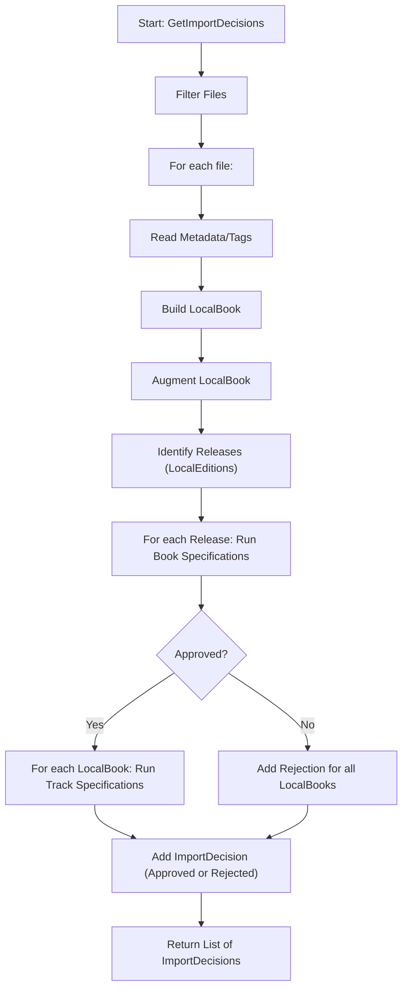

# Import Decision & Identification Flow

This document describes the technical flow for how Readarr processes and decides which book files to import, starting from the initial file list through to the final import decisions.

---

## Overview

The import decision process is responsible for:
- Filtering candidate files
- Reading metadata/tags
- Building internal representations (`LocalBook`)
- Augmenting with additional metadata
- Identifying possible releases/editions
- Applying a series of specifications (rules) to accept or reject each file
- Returning a detailed decision for each file

---

## Step-by-Step Flow

1. **Start: GetImportDecisions**
   - Entry point: [`IMakeImportDecision.GetImportDecisions(...)`](src/NzbDrone.Core/MediaFiles/BookImport/ImportDecisionMaker.cs#L19) (implemented by [`ImportDecisionMaker`](src/NzbDrone.Core/MediaFiles/BookImport/ImportDecisionMaker.cs#L47)).

2. **Filter Files**
   - Uses [`_mediaFileService.FilterUnchangedFiles`](src/NzbDrone.Core/MediaFiles/BookImport/ImportDecisionMaker.cs#L85) to filter out files that shouldn't be processed (based on config).

3. **For each file:**
   - **Read Metadata/Tags**
     - Uses [`_metadataTagService.ReadTags`](src/NzbDrone.Core/MediaFiles/BookImport/ImportDecisionMaker.cs#L109) to extract metadata from the file (e.g., author, book, edition, track info).
   - **Build LocalBook**
     - Constructs a [`LocalBook`](src/NzbDrone.Core/Parser/Model/LocalBook.cs#L9) object with file info and extracted metadata.
   - **Augment LocalBook**
     - Calls [`_augmentingService.Augment`](src/NzbDrone.Core/MediaFiles/BookImport/ImportDecisionMaker.cs#L126) to enrich the `LocalBook` with additional metadata (e.g., from online sources).
     - If augmentation fails, adds a rejection decision for that file.

4. **Identify Releases (LocalEditions)**
   - Calls [`_identificationService.Identify`](src/NzbDrone.Core/MediaFiles/BookImport/ImportDecisionMaker.cs#L157) to group `LocalBook` files into possible releases/editions, using any provided overrides.

5. **For each Release: Run Book Specifications**
   - Applies all [`_bookSpecifications`](src/NzbDrone.Core/MediaFiles/BookImport/ImportDecisionMaker.cs#L207) (implementations of [`IImportDecisionEngineSpecification<LocalEdition>`](src/NzbDrone.Core/MediaFiles/BookImport/IImportDecisionEngineSpecification.cs#L6)) to determine if the release is valid.
   - If any spec fails, collects rejection reasons.

6. **If Approved:**
   - **For each LocalBook: Run Track Specifications**
     - Applies all [`_trackSpecifications`](src/NzbDrone.Core/MediaFiles/BookImport/ImportDecisionMaker.cs#L239) (implementations of [`IImportDecisionEngineSpecification<LocalBook>`](src/NzbDrone.Core/MediaFiles/BookImport/IImportDecisionEngineSpecification.cs#L6)) to determine if the file is valid.
     - If any spec fails, collects rejection reasons.
   - **Add ImportDecision (Approved or Rejected)**
     - Adds the resulting [`ImportDecision<LocalBook>`](src/NzbDrone.Core/MediaFiles/BookImport/ImportDecision.cs#L8) to the final list.

7. **If Not Approved:**
   - **Add Rejection for all LocalBooks**
     - All files in the release are rejected with the collected reasons.

8. **Return List of ImportDecisions**
   - The result is a list of [`ImportDecision<LocalBook>`](src/NzbDrone.Core/MediaFiles/BookImport/ImportDecision.cs#L8), each containing the file, metadata, and any rejection reasons.

---

## Flow Diagram

---

## Key Classes & Interfaces

- [`IMakeImportDecision`](src/NzbDrone.Core/MediaFiles/BookImport/ImportDecisionMaker.cs#L19) / [`ImportDecisionMaker`](src/NzbDrone.Core/MediaFiles/BookImport/ImportDecisionMaker.cs#L47)
- [`IImportDecisionEngineSpecification<T>`](src/NzbDrone.Core/MediaFiles/BookImport/IImportDecisionEngineSpecification.cs#L6)
- [`ImportDecision<T>`](src/NzbDrone.Core/MediaFiles/BookImport/ImportDecision.cs#L8)
- [`LocalBook`](src/NzbDrone.Core/Parser/Model/LocalBook.cs#L9), [`LocalEdition`](src/NzbDrone.Core/Parser/Model/LocalEdition.cs#L9)
- [`IAugmentingService`](src/NzbDrone.Core/MediaFiles/BookImport/Aggregation/AggregationService.cs#L11), [`IIdentificationService`](src/NzbDrone.Core/MediaFiles/BookImport/Identification/IdentificationService.cs#L14)
- [`ImportDecisionMakerConfig`](src/NzbDrone.Core/MediaFiles/BookImport/ImportDecisionMaker.cs), [`IdentificationOverrides`](src/NzbDrone.Core/MediaFiles/BookImport/ImportDecisionMaker.cs)

---

## Notes
- Specifications are pluggable rules that accept or reject a file or release (e.g., free space, duplicate check, already imported, etc.).
- The process is modular and extensible, supporting both automated and manual imports.
- Each decision includes detailed rejection reasons for transparency and troubleshooting. 